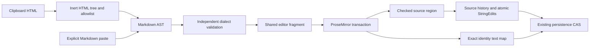

# Improved Editor V2

One branch and one PR, including the narrow-width Grid fix. Public layout
vocabulary remains **Grid / GridItem**. No reviewer polling, separate Grid PR,
merge or deployment. Proposal: https://artifactbin.dev/a/haPmQt.
Review PR: https://github.com/minusxai/artifactbin/pull/89.

## Boundaries and final contracts



- `editor-v2/model.ts` owns JSX ↔ engine conversion. Continuous regions contain
  supported static prose; live components, expressions and managed content stay
  outside them. React owns region boundaries, ProseMirror their descendants.
  Flow Grid retains the reader tree and live islands during edit entry. The
  existing positioned Grid adapter remains separate internally.
- `clipboard.ts` converts HTML directly through rehype-remark to mdast; there is
  no Markdown text intermediate. `clipboard-ast.ts` independently rejects
  unsupported fields, invalid child structure and excessive complexity before
  `pasteFragment` inserts either syntax. Raw HTML, active elements, presentation
  attributes, classes and source IDs cannot pass this boundary.
- The dialect includes headings, paragraphs, strong/emphasis/strikethrough,
  inline/fenced code, lists, blockquotes, tables, safe links, breaks and rules.
  Reference links resolve before insertion. External image markup becomes alt
  text; image files retain the managed upload path. Plain text is literal by
  default; Paste Markdown explicitly interprets Markdown. Code paste is literal.
  Legacy/unsupported editable hosts do not accept native rich HTML; they expose
  a useful refusal and retain typing/plain-text support.
- Text replacement across adjacent prose blocks keeps the first surviving ID;
  splits mint fresh IDs. Moves preserve IDs. Inline marks also receive distinct
  identities when split. Unchanged source echoes retain the engine/DOM.
- **Cross-column fallback selected:** separate editor roots preserve React/data
  boundaries. A cross-root range upgrades to whole source blocks in document
  order. Delete removes those blocks; every column survives with an empty
  paragraph when necessary. Typing, composition and paste cannot replace that
  block selection. Escape cancels it. No geometry-based text redistribution.
  Single-cell text editing is supported; destructive cross-cell replacement is
  refused with an explanation.
- `history.ts` owns a bounded source history, grouping typing but keeping paste,
  layout and deletion atomic. Undo/Redo buttons and Ctrl/Cmd-Z,
  Ctrl/Cmd-Shift-Z / Ctrl-Y use the same history. Source-relative bookmarks
  restore text selections. Inverses reuse the existing source conflict kernel:
  unrelated remote changes survive and overlapping inverses are refused.
- `annotation-map.ts` derives absorbed-block lineage from transaction positions.
  `story/annotation-edits.ts` validates exact text segments and computes
  conditional relation updates. The source CAS and relation changes commit
  together; `artifact_edits.annotation_changes` records receipts. Undo restores
  a relation only if it still matches the receipt. Missing receipts refuse Undo;
  ambiguous/unmapped comments retain their existing fallback. Retry queues
  preserve and deduplicate annotation operations.
- Save failures retain the draft and block navigation. Retry rebases against the
  current server document; replacing the draft requires an explicit choice.
  Refused local fragments stay available for copying before explicit discard.
- `Grid mode="flow"` uses `w` spans, intrinsic height and optional pixel
  `minHeight`. Flow rejects x/y/h. Auto height removes the minimum. Adjacent
  dividers preserve the row total; source order governs stacking. Positioned
  Grid retains x/y/w/h and sibling collision/compaction behavior.
- Dedicated handles own previews, pointer capture and keyboard staging; one
  release/Enter commits. Escape, cancellation and changed source geometry cancel
  the preview. Selected source blocks expose ×. SVG internals and inline marks
  do not receive layout handles. Width resizing retains responsive max-width;
  height resizing uses minimum height so growing prose is not clipped.
- Text tools occupy the fixed top editor bar. Document options remain reachable.
  Toolbar interaction preserves the text range; Markdown dialog traps Tab and
  handles Escape. Coarse-pointer layout controls have 44px targets.

## Phases and executable evidence

The sequence was baseline/contracts → executable engine, AST, identity/history
and Grid proofs → integrated production gate → complete interaction/recovery
coverage → broad regression checks → one PR. Integration code was used to
exercise browser-sensitive proofs; those checks were not declared proven solely
from model tests. The original planning-only probes are historical evidence.

| Phase | Evidence and status |
|---|---|
| Baseline | Main `6feb714053b19201797e278b24f892c82a62c421`: API 1,354, Node 3,872, UI 1,338 and CLI 25 tests passed; one existing Node skip. |
| Engine and AST | Model, clipboard, independent validation, mounted flow and source-region checks. Observed failures include duplicate inline IDs after split and unsupported reference-link loss; fixes pass their regressions. |
| Identity/history | Source rebase/history tests, exact annotation-map test, real API merge/undo/redo, permission/refusal and independent relation-update checks. Retry regression detected duplicate annotation operations before the fix. |
| Grid and interactions | Narrow reader/edit parity, flow intrinsic sizing, paired spans, empty-column placeholders, keyboard movement and cancellation, persistent positioned tile keys and flow-island lifetime checks. |
| Integrated browser | `editor-v2` passed cross-paragraph replace/range restoration; semantic toolbar formatting; real HTML/Markdown/code paste and one-step Undo; ×; keyboard resize/move/divider; pointer preview and one-commit resize; pointer cancellation; two-column keyboard fallback and backward three-column deletion; mobile flow/positioned stacking; IME composition including an in-flight save response; unrelated remote update + Undo; single-cell editing/cross-cell refusal; persistence/reload. |
| Input and performance | Optional Firefox, WebKit and Chromium-touch probes passed cross-paragraph replacement, Undo and persistence; touch also passed stacking and ×/Undo. Chromium CDP composition committed Japanese text intact. A 300-paragraph fixture became editable in 852ms including navigation and showed an input change in 27ms in the recorded run. These are bounded observations, not universal latency guarantees or physical-device/keyboard claims. |
| Broad verification | Full suite passed: 1,355 API, 3,907 Node, 1,371 UI and 25 CLI tests; one existing Node skip. The initial all-gates run passed every gate except SVG asset sizing; the remaining SVG layout shift was traced to missing reserved dimensions and fixed with a failing-then-passing regression. All affected-flow reruns passed, including `web-assets` with CLS 0.0000 and the final `app-flows` / `editor-v2` rerun. |
| Delivery | One empty-body review PR. GitHub checks on the submitted revision are the CI delivery record; no merge or deployment. |

## Reproduce

From the repository root:

```sh
npm run validate
npm test
npm run build
npm run test:gates -- --only=editor-v2,inplace-edit,real-paste,editor-flow --servers=1
npm run test:gates -- --servers=2
npm ci --dry-run
# Optional, with Firefox/WebKit installed and a disposable local app running:
node scripts/probes/editor-v2-browsers.mjs http://localhost:4480
```

Targeted behavioral tests live in `services/app/lib/editor-v2/__tests__`,
`services/app/__tests__/editor-v2-annotations.test.ts`, the Grid adapter tests,
and the existing live-edit/runtime UI suites. The complete browser fixture is
`scripts/gate-editor-v2.mjs`; optional engine/touch coverage is in
`scripts/probes/editor-v2-browsers.mjs`.

## Practical limits

This is source-block editing, not universal direct manipulation of arbitrary
CSS, SVG drawing internals, iframe DOM or script-generated content. Positioned
Grid keeps its pre-existing edit adapter; switching that adapter can remount its
tiles. Flow Grid and live siblings retain their React lifetimes. Comments with
ambiguous lineage keep their existing fallback rather than guessing by quote.
History is session-local and bounded to 100 entries. Physical mobile devices,
physical IME keyboards and assistive-technology combinations were not exercised.

## Final verification ledger

`VITEST_MAX_WORKERS=4 npm test` passed all four suites (counts above). Earlier
high-concurrency attempts hit disposable PostgreSQL/app-startup timeouts; the
constrained run passed those cases without relaxing assertions. Type checks and
production builds passed; the lockfile dry run passed. Schema, class candidates
and plugin outputs were regenerated through their owning commands.

The full browser run exposed an old imported-SVG sizing gap: a 40px SVG reserved
no height until load, shifting its following image (CLS 0.0271). Explicit root
pixel dimensions are now read without decoding SVG or resolving XML resources;
original bytes and security headers are unchanged. The regression passed after
failing with null dimensions, and the production gate measured CLS 0.0000.

The last integration run caught duplicate formatting ownership: both the engine
and parent composed the same source change, causing the refusal guard to stall
subsequent saves. Selection messages now identify engine-owned blocks, so the
parent delegates formatting and accepts exactly one checked engine write-back.
The UI regression failed before this fix; the final production `app-flows` gate
then passed formatting, title/theme saves and Grid movement. Empty Slide/table
cell deletion also retains an editable paragraph, with a red/green regression.

The final `app-flows` and `editor-v2` rerun passed both gates. The preceding run
passed `editor-exit`, `inplace-edit`, `real-paste`, `web-assets` and `editor-v2`.
Together with the full all-gates run, every gate has a passing result; this is
not represented as one uninterrupted all-green full run. PR CI runs the complete
matrix again against the submitted revision.


Final cross-engine probes also passed against the submitted production build:
Firefox, WebKit and Chromium touch (replace, Undo and save; touch stacking and
×/Undo). Additional production assertions cover block formatting after a text
replacement, button Undo and two-action rapid Undo. CI's full browser matrix
passed on the initial submission. CodeQL identified global XML-comment stripping
in the SVG sizing helper; a regression demonstrated that malformed tag text could
be joined into a false root. The helper now consumes only complete leading
preamble items, leaving tag contents untouched. The regression passes. Current
CI results are attached to the PR revision rather than frozen in this document.


## Review refinements: selection and resizing

- Native text highlighting continues through separate edit regions. While the
  cross-region block fallback owns input, mounted prose regions temporarily
  release their contenteditable selection boundaries. Escape or a new caret
  placement restores editing; source and engine identities stay intact. The
  agreed whole-block Delete and refusal of cross-region text replacement remain.
- Finishing a text drag no longer selects its common layout container. Text
  selections hide resize controls. Node boundaries are faint, with no filled
  backgrounds; resize points and the compact × are circular. Touch hit targets
  retain their larger accessible size.
- Resize previews now reflow content through a scoped temporary stylesheet,
  coalesced to animation frames. The preview overrides existing width utilities
  without writing authored style attributes. It remains through the source/CSS
  acknowledgement and is then removed. Cancel restores the original layout;
  release still produces one source transaction and one Undo action.
- Observed regression failures covered accidental container selection, scroll
  resetting active preview geometry, and existing important width utilities
  preventing live reflow. The updated Chromium gate checks the exact native text
  range, no background fill/container handles, shrinking before release, source
  persistence and Undo. Cross-engine probes also exercise a real pointer range.


The refined local suite passed 1,355 API, 3,907 Node, 1,371 UI and 25 CLI tests,
with the existing Node skip. Focused UI tests, type checks and the production
build passed. Firefox, WebKit and Chromium touch passed actual pointer selection
across regions, Escape restoring editing, replacement, Undo and persistence.
Native text HTML dragging is prevented so adjusting an existing selection cannot
move content between engines; block movement remains owned by the dedicated grip.
Firefox pointer-release range collapse is handled by restoring the exact native
endpoints before paint. No physical-device claim is made.
